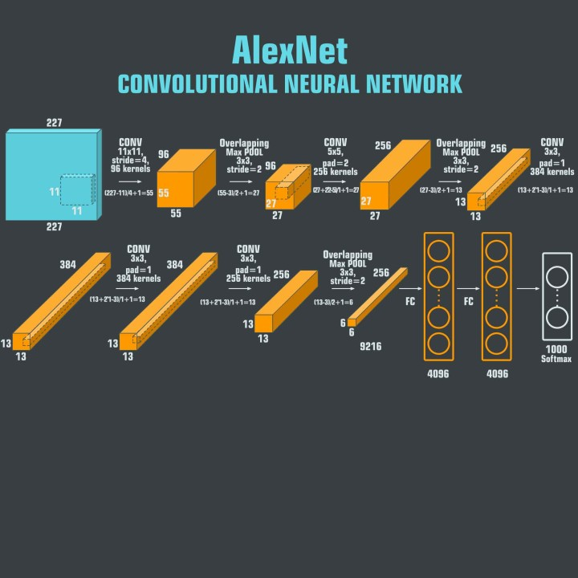
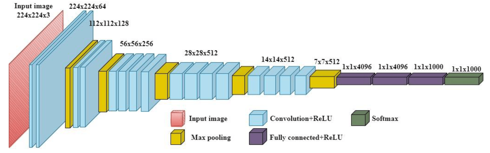
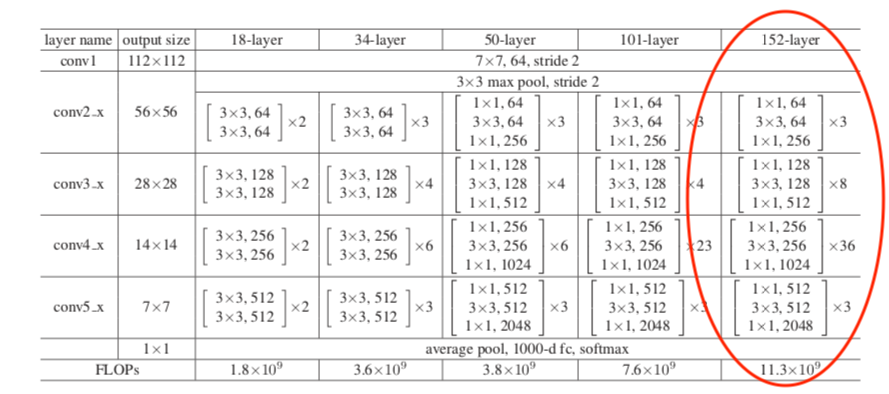
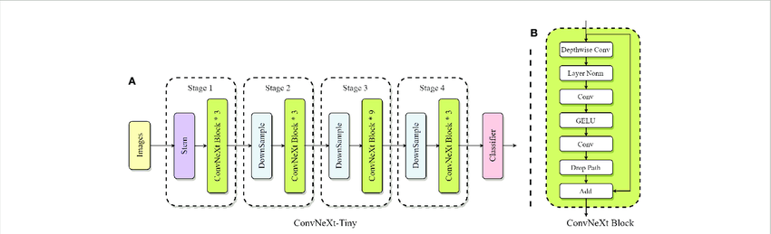
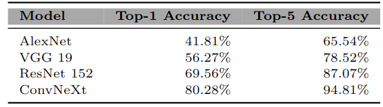
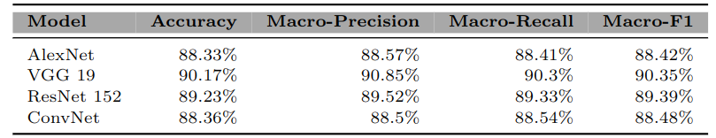
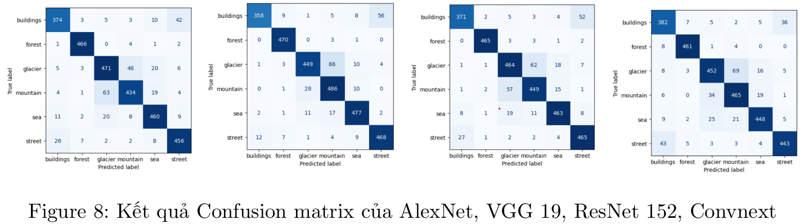
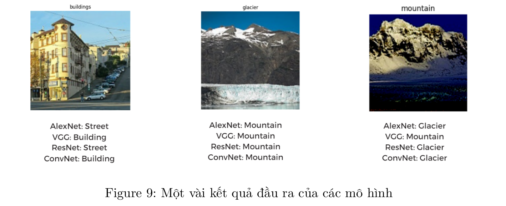

# Introduction
This repository contains our some image classification model implementations (AlexNet, VGG19, ResNet152, Convnext), report, experiment results and our insights about performance of these models for the mid-term project of INT3412E 20 in VNU-UET.
# Description
We do experiments base on 2 datasets [ImageNet Object Localization Challenge](https://www.kaggle.com/competitions/imagenet-object-localization-challenge/data) and [Intel Image Classification](https://www.kaggle.com/datasets/puneet6060/intel-image-classification).  
* With ImageNet dataset, because of limitation about hardware and time, we can't train models that we have implemented with train data of this dataset so that we have used Pytorch pretrained models to predict class of images in validation data (which includes 50k images of 1000 classes (labels)). 
* With Intel dataset, we have trained our models on training data (14034 images of 6 labels), adjusted hyper parameters using validation data (3000 images) and evaluated on test data (7000 images).  

Below is model architectures that we have built:

|  |
|:--:|
|*AlexNet Architecture*|

| |
|:--:|
|*VGG19 Architecture*|

|  |
|:--:|
|*RestNet152 Architecture*|

|  |
|:--:|
|*ConvNeXt Architecture*|
# Result
## Result for imagenet dataset

## Resulf for intel dataset
||
|:--:|
|*Models' Performance*|

||
|:--:|
|*Confusion Matrix*|

||
|:--:|
|*Examples*|

Here is our results when set hyper-parameters as:  
* Batch-size: 64
* Learning rate: 1e-4
* Epochs: 30

## Reproduce
You can easily reproduce our results by doing following steps:
* Step 1: If you had have a Kaggle account omit this step or else you need to create one
* Step 2: Log in to kaggle, go to Setting, create new API token and download kaggle.json file to Downloads folder
* Step 3: Run these commands to create a API token that used to download dataset:
```
mkdir ~/.kaggle
cd ~/Downloads
mv kaggle.json ~/.kaggle
chmod 600 ~/.kaggle/kaggle.json
```
* Step 4: Clone our repository to your folder:
```
cd <folder-path>
git clone https://github.com/lvdthieu/Computer_Vision.git
```
* Step 5: Clone our repository:
```
// (Optional) Create a new conda environment
conda create -n cv python=3.11
conda activate cv

// Clone and install the necessary packages
git clone https://github.com/lvdthieu/Computer_Vision.git
pip install -r requirements.txt
```
* Step 6: Download dataset:
```
kaggle datasets download --unzip thieuluu/cv-data
```
* Step 7: 
```
python imagenet.py // if you want to see results for imagenet dataset  
python intel.py --help // to see options when experiment with intel image classification dataset
// Eg:
python intel.py --model alexnet --seed 0 --batch 64 --learning_rate 1e-4 --epochs 30
```

# Authors
This repository was made by Team4 consist of 4 members:  
[Luu Van Duc Thieu](https://github.com/lvdthieu)  
[Hoang Thai Quang](https://github.com/htwuto)  
[Pham Thu Trang](https://github.com/ThuTrang513)  
[Ho Thi Thanh Binh](https://github.com/fivontwov)  
# License
[MIT](https://choosealicense.com/licenses/mit/)


